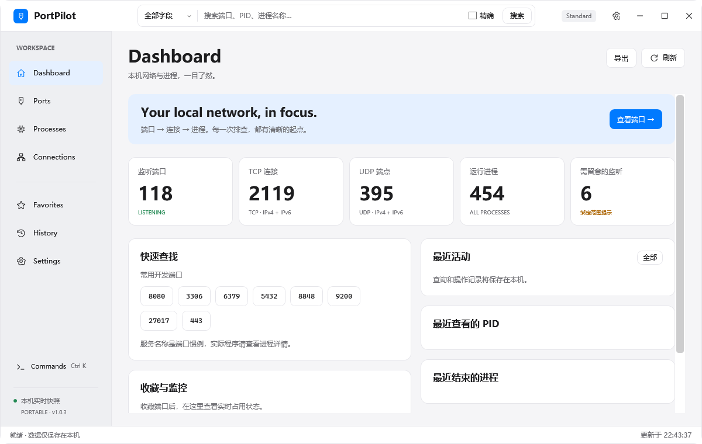
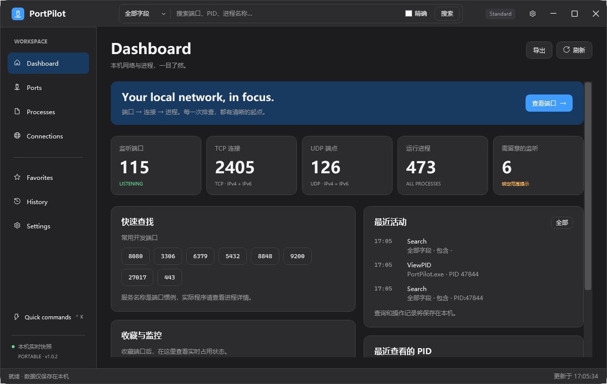

# PortPilot

A lightweight Windows port & process inspector.

面向 Windows 开发者的本机端口、PID、进程诊断工具。使用 **.NET 8 / WPF / MVVM**，通过 Windows IP Helper 与进程 API 读取实时信息，不解析 netstat 命令输出。

## 1.0.4 内存与刷新优化

- 按搜索/筛选条件启用所需字段监听，CPU、内存采样只更新变化的显示字段；PID 端口汇总在后台每轮计算一次。
- Network 列表只创建可见区域附近的控件，滚动时复用；关闭详情会释放展示数据并取消请求。
- 详情缓存最多保留 32 项，估算保留预算 4 MiB，5 分钟过期；进程退出、超出容量或手动清缓存时释放。
- 同机约 2400–2900 个端点的对比中，工作集峰值约 **489 → 292 MiB**，Dashboard 每轮分配约 **17.9 → 2.9 MiB**。数据规模、访问过的页面和系统运行时会影响内存，完整口径见 [内存验证记录](docs/MEMORY-1.0.4.md)。

## 1.0.3 图标修复

- 修复部分 Windows 11 环境中图标显示为方框的问题：界面图标改为随 EXE 内置的矢量绘制，不再依赖 Segoe Fluent Icons / MDL2 图标字体。
- 覆盖侧栏、窗口控制、搜索下拉、刷新、详情关闭、空状态和进程树图标；保持主题颜色与高 DPI 缩放。

## 1.0.2 问题修复

- 搜索改为 **Enter 或点击“搜索”后执行**。输入、粘贴、切换字段和精确选项时不再反复筛选列表；手动/自动刷新继续使用上次提交的条件。清空后提交可恢复全部结果。
- 修复进程详情 **Network** 页的协议、状态只读属性绑定异常，支持多端点展示和刷新。
- 常用端口、收藏查询、“查看 PID 全部端口”仍可一键执行。

## 1.0.1 搜索优化

- 修复搜索框重复内边距导致的文字底部裁切；中文、英文字母和长路径保持垂直居中，长文本随光标水平滚动。
- 搜索框左侧可选择 **全部字段 / 本地端口 / 远程端口 / PID / 进程名称 / 程序路径 / IP 地址**，只匹配选中的字段。
- 勾选右侧 **精确** 后，文本字段按完整内容匹配，忽略大小写；取消勾选使用包含匹配。端口与 PID 始终按数字精确匹配。

| 想查什么 | 字段 | 输入 | 精确开关 |
| --- | --- | --- | --- |
| 本地监听/占用端口 8080 | 本地端口 | `8080` | 数字始终精确，不混入 PID 8080 或远程端口 |
| PID 为 8080 的进程和连接 | PID | `8080` | 数字始终精确，不混入本地端口 8080 |
| 完整名称为 java.exe 的进程 | 进程名称 | `java.exe` | 勾选 |
| 名称包含 java 的进程 | 进程名称 | `java` | 不勾选 |
| 指定可执行文件 | 程序路径 | `C:\Tools\Java\bin\java.exe` | 勾选 |
| 指定远程端口 | 远程端口 | `443` | 数字始终精确 |

全部字段模式仍保留原有综合搜索，也支持 `port:8080`、`pid:1234`、`process:java.exe`、`path:C:\Tools\app.exe`、`remoteport:443`、`ip:127.0.0.1` 前缀。选定具体字段后输入原始值即可。完整进程名称包含 `.exe` 后缀；输入 `java` 并开启精确时不会匹配 `java.exe`。

常用端口、收藏查询和“查看 PID 全部端口”会自动选择对应字段。Ctrl + F 聚焦搜索，输入后按 Enter 或点击“搜索”查看分组结果。

## 直接运行

从 [GitHub Releases](https://github.com/LiguoXia/PortPilot/releases/latest) 下载 `PortPilot-win-x64.zip`，解压后双击 `PortPilot.exe`。也可以直接下载 EXE。本地编译的输出位于 `release/PortPilot.exe`。

发布版为 **Windows x64、自包含、单文件 EXE**，无需安装 .NET，无需安装服务。建议 Windows 10 1809 或更高版本 / Windows 11 x64；当前版本在本机构建并验证。

把 EXE 放在一个可写目录，例如 `D:\Tools\PortPilot`。首次启动自动创建 EXE 旁的 `data`。搬家时复制 **EXE 和 data 整个目录**，即可保留设置、收藏、备注和历史。

## 界面

以下截图由独立测试副本生成，仅包含空白初始界面或测试操作。含本机路径、进程列表和 IP 的完整诊断截图仅保留在本地，不发布到仓库。






## 已实现

- Dashboard：监听、TCP 连接、UDP 端点、进程统计；敏感端口全地址监听提示；常用/最近端口、收藏、最近查看与结束记录。
- TCP / UDP **IPv4 + IPv6** 原生扫描。端口 → PID、PID → 全部端点双向查询。
- 全局搜索：端口号、`PID:1234`、进程名、路径、`localhost:8080`、IP、远程端口和状态。Enter 打开分组搜索。
- Ports：协议、地址、端口、状态、PID、名称、路径、用户、CPU、内存、启动时间；筛选、多列排序、Ctrl / Shift 多选。
- Processes：资源占用、连接数、监听端口、父 PID；可展开的进程树与详情面板。
- Inspector：启动参数、工作目录、架构、权限等级、父子关系、模块、环境变量名、文件版本、公司和离线嵌入签名验证。
- 正常关闭、Force Kill、结束进程树、释放端口；显示全部受影响端口，按 PID 去重，二次确认树操作。
- Windows 关键进程保护；操作前校验 **PID + 启动时间 + 进程是否仍存活**，再检查真实可执行名称和系统 critical 标记。
- 按需 UAC 管理员操作窗口；可从设置重新提升整个应用以读取受限信息。普通启动不要求 UAC。
- 收藏端口、PID、进程名称；编辑名称/备注；Free / Occupied / Unknown 状态及 New / Released 历史。
- 独立端口备注、1000 条以内历史、滚动日志、配置损坏备份与恢复。
- Light / Dark / System 主题；系统主题变化跟随；自定义窗口、表格、按钮、输入框和滚动条。
- 自动刷新 1 / 2 / 3 / 5 / 10 / 30 秒、手动刷新、后台扫描、互斥刷新、增量集合更新和 live filtering / sorting。
- Command Palette；当前列表或选中行导出 CSV / JSON / TXT；CSV 防公式注入；复制及打开文件位置。

## 快捷键

| 快捷键 | 操作 |
| --- | --- |
| Ctrl + F | 聚焦全局搜索 |
| Enter（搜索框） | 分组搜索 |
| F5 / Ctrl + R | 刷新 |
| Ctrl + C（列表） | 复制选中条目 |
| Delete（列表） | 确认后请求正常关闭进程 |
| Ctrl + K | 打开命令面板；方向键 / Enter 执行 |
| Esc | 关闭命令面板 / Inspector |

## 源码与构建

需要 .NET **8 SDK**。运行 EXE 不需要 SDK。

```powershell
.\build.ps1
# 可选：包含发布版 UI 冒烟测试与截图
.\build.ps1 -UiSmokeTest
```

脚本依次 Clean、Restore、Build、Test、Publish。会优先使用工作区 `.tools/dotnet/dotnet.exe`，不存在时使用 PATH 中的 `dotnet`。首次构建需联网还原 NuGet 与 Windows 运行时包。

等价命令：

```powershell
dotnet restore PortPilot.sln
dotnet build PortPilot.sln -c Release
dotnet test tests/PortPilot.Tests/PortPilot.Tests.csproj -c Release
dotnet publish src/PortPilot/PortPilot.csproj -c Release -r win-x64 --self-contained true -p:PublishSingleFile=true -o release
```

```text
PortPilot/
├── PortPilot.sln
├── Directory.Build.props
├── build.ps1
├── src/
│   ├── PortPilot/              # WPF 壳、Views、ViewModels、UI Services、Resources
│   └── PortPilot.Core/         # Models、Native、Services、Infrastructure
├── tests/PortPilot.Tests/      # 真实 Windows API 集成测试与业务测试
├── docs/                      # 验证记录、截图
└── release/
    ├── PortPilot.exe
    ├── README.md
    └── data/                  # 首次运行创建
        ├── config.json
        ├── favorites.json
        ├── ports.json
        ├── history.json
        ├── cache/
        └── logs/app.log
```

主程序由依赖注入组装服务，ViewModel 不直接执行复杂 P/Invoke。核心依赖仅 CommunityToolkit.Mvvm 和 Microsoft.Extensions 系列。运行期不需要数据库、网络 API 或第三方服务。

可复现内存与响应测试：`./measure.ps1`。脚本将 EXE 复制到新的独立测试目录，额外创建 400 个回环监听端点，依次运行 Dashboard、Ports、Network、反复查看详情、关闭详情并移除测试端点五个阶段，各 40 秒。`./measure.ps1 -PhaseSeconds 120` 运行约 10 分钟。报告记录工作集、私有提交内存、托管内存、分配量、刷新耗时和 UI 调度延迟，不触碰原有 data。不要同时运行多组测试，其他程序的负载会影响结果。

## 数据与权限

- 使用 `AppContext.BaseDirectory/data`，不使用工作目录、AppData 或注册表保存业务配置。只读系统主题注册表项。
- JSON 写入使用临时文件、`Flush(true)`、原子替换。损坏 JSON 改名为 `*.corrupted.<时间戳>.<随机值>.json` 后恢复默认数据。
- 日志按日期或约 2 MB 滚动，下次写入时清理 7 天前的滚动日志。不记录环境变量值或完整启动参数。
- 单文件运行时可能由 .NET 将原生组件解压至系统临时缓存；这是运行时机制，**业务数据始终在 EXE 旁**。没有 AppData 业务数据。
- 普通权限无法读取受保护进程的全部信息时，显示 Access Denied / Unavailable。打开 Settings 可通过 UAC 重新打开管理员实例。
- 结束受限进程失败时，可以启动同一 EXE 的管理员操作模式。提升窗口重新确认目标并验证身份；不会直接信任传入的 PID。
- 正常结束使用 `CloseMainWindow`。无窗口或不响应的程序需要显式 Force Kill；不会自动升级为强杀。
- System、Registry、smss、csrss、wininit、winlogon、services、lsass、svchost 等及 PortPilot 自身默认禁止结束。
- 释放端口实际是结束占用进程，影响该进程**所有端口与连接**，并非独立关闭单个监听端口。

## 信息语义与限制

- IP Helper 提供快照。端点可能在两次刷新间消失或被重建；进程与网络表读取存在短暂时序差异。
- Duration 是首次观测时长，**不是系统记录的连接创建时长**。同一端点在两次扫描之间重建无法被可靠识别。
- 空列表表示当前快照及筛选没有结果，不能保证端口可绑定（排除端口范围、ACL、独占绑定等也会影响绑定）。
- 端口名称只是惯例。风险计数表示常见敏感端口在所有地址上监听，**不代表已确认漏洞或外网可达**。
- 进程树根据当前快照构建，父进程身份无法核实时作为根节点；结束树只针对确认时列出的目标，不追杀之后生成的新子进程。
- PID 收藏跟随编号，PID 复用后会显示新的进程；操作与详情缓存仍校验 PID + StartTime。
- CPU 是相邻采样间、按逻辑处理器数量归一化的进程 CPU；第一帧为 0。内存为 Working Set。详情的资源字段注明读取时快照，列表持续更新。
- 工作目录和环境变量名读取依赖 Windows 进程参数布局，权限不足或不支持时显示不可用。**不展示或记录环境变量值**。
- 签名验证为 WinVerifyTrust 离线嵌入签名校验，未查询吊销状态，也未检查 Windows 目录签名。PortPilot 发布 EXE 本身尚未使用商业证书签名。
- 缓存当前为内存缓存；`data/cache` 预留并用于可选诊断输出。模块列表与静态详情随进程身份缓存，可手动清除。
- 目前使用统一线性进程图标，尚未提取每个程序自己的图标；未增加复杂动画。
- UAC 提示属于 Windows 安全桌面，需真实用户交互；自动化测试不绕过该提示。
- 性能目标依赖进程数量、权限及硬件；不承诺所有机器均达到 <1 秒 / <1% CPU / <150 MB。实测见 `docs/VALIDATION.md`。
- 单个便携目录建议只运行一个普通实例，避免多个实例同时编辑收藏/历史时发生最后写入覆盖。

## 常见问题

**EXE 被 SmartScreen 提示？** 当前版本未代码签名。请确认构建来源与 SHA256；无需关闭系统安全功能。

**启动提示目录不可写？** 将整个目录移到当前用户可写的位置。程序不会偷偷切换到 AppData。

**结束按钮为什么不可用？** 当前条目属于受保护进程，或无法核实启动时间。可查看状态；受保护核心进程不会因管理员权限而解除保护。

**窗口选中行后出现右侧面板？** 是 Inspector，按 Esc 收起。窄窗口下采用覆盖式 Drawer，避免压缩表格列。

**收藏怎么添加？** 选择端口后点击详情里的收藏，或在 Ports 页面批量收藏。对空闲端口输入数字查询后，可在空状态加入监控。进程/PID 收藏在右键菜单中。

**导出到哪里？** 点击导出后自行选择路径；不会默认写入 data。CSV/JSON/TXT 输出当前过滤列表，底部“导出选中”只输出选中行。

**删除历史会影响程序吗？** 不会。程序退出后也可复制 data 备份。缓存可以清除，收藏与备注分别保存。

## API 参考

- [Microsoft · GetExtendedTcpTable](https://learn.microsoft.com/en-us/windows/win32/api/iphlpapi/nf-iphlpapi-getextendedtcptable)
- [Microsoft · .NET single-file deployment](https://learn.microsoft.com/en-us/dotnet/core/deploying/single-file/overview)
